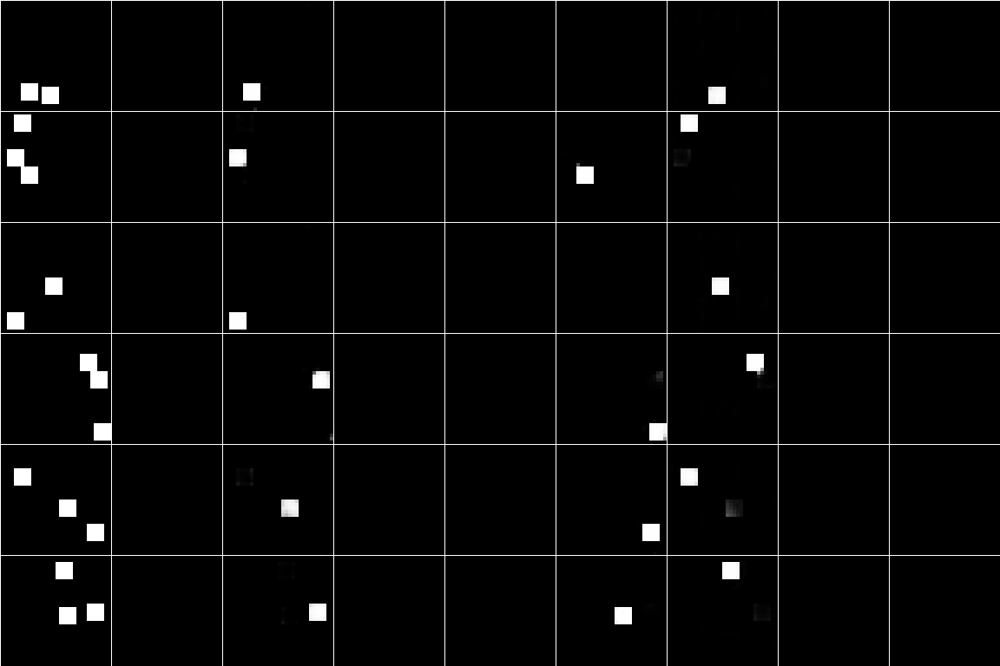

### Maskformer

Last update: May 2023.

---

Implementation of Maskformer (Cheng et al. 2021) for instance segmentation.

The setup is very similar to set prediction for object detection (Carion et al. 2020). We query a Transformer with an overdetermined set of queries, each of which represents an instance-level mask. At training time, Hungarian matching allows each query to learn to snap to one particular mode rather than splitting across modes.

In the figure below, the groundtruth is on the left. Queries use positional embeddings to separate instances.



One noteworthy innovation of the Maskformer paper is representing each query's instance segmentation output as the dot product of a high resolution feature with a query-specific feature. This saves a significant amount of time compared to up-sampling an instance mask per query.

Each mask has a loss consisting of classification and mask terms:
```math
\mathcal{L}(\mathbf{y}, \hat{\mathbf{y}}) = \lambda_\mathrm{cls}\mathcal{L}_\mathrm{cls}(y_\mathrm{cls}, \hat{y}_\mathrm{cls}) + \lambda_\mathrm{mask}\mathcal{L}_\mathrm{cls}(\mathbf{y}_\mathrm{mask}, \hat{\mathbf{y}}_\mathrm{mask})
```

We implement a couple loss functions for the mask, given per-pixel predictions $p \in [0, 1]$ and groundtruth $y \in \{0, 1\}$.
1. Binary Cross-Entropy. $-y\log p - (1-y)\log (1-p)$.
2. Brier Score. $(p - y)^2$.
3. Dice Loss.

The forward pass is extremely simple:

```python
    def forward(self, x):
        low_res_feat, high_res_feat = self.nn_module(x)
        low_res_feat = rearrange(low_res_feat, "b c h w -> b (h w) c")

        # Transformer blocks attend to the low resolution feature
        queries = repeat(self.query_embed, "t c -> b t c", b=len(x))
        for block in self.decoder_blocks:
            queries = block(queries, memory=low_res_feat)
        queries = self.ln(queries)

        # Predicted masks formed via per-pixel dot product w high resolution feature
        mask_embed = self.mask_embed_convs(queries)
        masks = torch.einsum("b t c, b c h w -> b t h w", mask_embed, high_res_feat)

        # Predicted classes via straightforward MLP
        classes = self.class_convs(queries)
        return masks, classes
```

Todo: find an implementation of Hungarian matching i.e. `linear_sum_assignment` on GPU.

#### References

[1] Cheng, B., Schwing, A. & Kirillov, A. Per-Pixel Classification is Not All You Need for Semantic Segmentation. in Advances in Neural Information Processing Systems vol. 34 17864–17875 (Curran Associates, Inc., 2021).

[2] Carion, N. et al. End-to-End Object Detection with Transformers. in Computer Vision – ECCV 2020 (eds. Vedaldi, A., Bischof, H., Brox, T. & Frahm, J.-M.) 213–229 (Springer International Publishing, 2020). doi:10.1007/978-3-030-58452-8_13.

